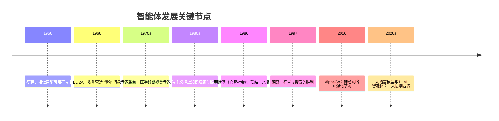
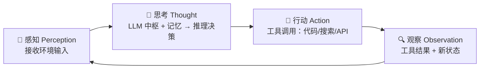

# CHAPTER 2 Notes 智能体发展史

智能体从"人写规则" → "机器自己学"，每一代都在解决上一代的痛点，又带来新痛点。

## 演进图

## ⏳ 关键时间线

---

## 2.1 符号主义：把世界写成"死板菜谱"
核心信念：**智能 = 设计者预先写好的规则，不会自学**。

### 专家系统
- **知识库**：IF-THEN 规则（如"IF 发烧 AND 咳嗽 THEN 可能感染"）
- **推理机**：正向链（从线索推结论）/ 反向链（先立假设再找证据）

### 符号主义四大困境
| 困境 | 一句话 |
| --- | --- |
| 知识获取瓶颈 | 专家经验说不清、写不完 |
| 常识问题 | "水是湿的"这类背景知识没法穷举编码 |
| 框架问题 | 动作后哪些没变，难以逐一声明 |
| 系统脆弱性 | 规则外一点变化就彻底失灵 |

---

## 2.2 ELIZA：听不懂人话却装得很懂的"鹦鹉"
不懂内容也能营造"智能"假象，而假象的观众是人类自己。

核心机制：模式匹配 + 文本替换（关键词识别 → 分解 → 重组 → 代词转换）。

**三大局限**：
1. **缺乏语义理解**——不认识"not"，机械反问；
2. **无上下文记忆**——只盯当前这一句，聊不了多轮；
3. **规则扩展性灾难**——规则越多越冲突爆炸，最终无法维护。

没有真正的理解，只有符号操作——这就是脆弱性的根源。

---

## 2.3 心智社会：蚂蚁军团建起的智能帝国
智能 ≠ 一个全能大脑，而是一群"无心"的小模块互相激活、**涌现**出来的。

| 概念 | 含义 |
| --- | --- |
| 智能体（agent） | 极简、专门化模块（如 GRASP 只会抓） |
| 机构（Agency） | 一组 agent 协同完成复杂任务 |
| 涌现（Emergence） | 无总指挥，局部交互自发产生复杂行为 |

**影响**：开启多智能体系统（MAS）、去中心化控制、蚁群算法、智能体社会性（通信/协商）。

---

## 2.4 学习范式：让机器自己"学会做题"

### 🕸️ 联结主义（神经网络）
知识**分布式存在权重里**，靠反向传播学习。解决**感知**问题（"图里是什么"）。

### 🐶 强化学习（RL）
无标准答案，靠**奖励试错**学策略（AlphaGo 自我对弈）。解决**决策**问题。
- 五要素：Agent / 环境 / 状态 / 行动 / 奖励
- 目标：累积回报，而非即时奖励

### 📚 大规模预训练
自监督（预测下一个词）从海量文本学知识，干掉了"知识获取瓶颈"。
- **涌现能力**：上下文学习（few-shot）、思维链（CoT）

### 🤖 基于 LLM 的智能体：给大脑配上眼手脚
核心闭环四步（与第一章 ReAct 呼应）：

专家系统 = 知识库+推理机；今天 = LLM（知识库+推理机二合一）+ 记忆 + 规划 + 工具。架构神似，血肉全换。

---

## 🌊 三大思潮合流
| 流派 | 主张 | 留给今天的遗产 |
| --- | --- | --- |
| 符号主义 | 符号 + 逻辑推理 | 推理、规划、可解释 |
| 联结主义 | 神经网络学权重 | 感知、LLM 底座 |
| 行为主义 | 试错学策略 | 决策、回报优化 |

LLM 是联结主义产物，却充当符号推理 + 规划 + 工具调用的"大脑"——三大流派在同一架构会师。

---

## 📝 做题记录（挑 3 道重点）

### 习题 1 · 符号主义痛点
- **PSSH（物理符号系统假说）**：充分性 = 符号操作就够用；必要性 = 通用智能必然是符号系统。
- **四大困境**挑战"充分性"：知识写不完、常识难编码、框架问题、脆弱性。
- **LLM 冲击**：智能不来自显式符号规则，而来自分布式表征 → "必要性"已被证伪。

### 习题 5 · 强化学习 vs 监督学习
- RL 无标准答案，靠后果打分（AlphaGo 胜+1/败-1，分摊到每一步）。
- 适合**序贯决策**：当前行动好坏取决于后续一串行动（累积回报）。
- 马里奥用 RL 更合适（有可交互环境 + 奖励，无现成标准操作）。
- RL 在 LLM：RLHF/DPO 对齐阶段，让模型"说人类喜欢且对的话"。

### 习题 7 · 跨时代设计"代码审查助手"
- **1980s 符号**：手写规则，写不出"意图/逻辑漏洞"，语言一变规则全重写。
- **2015 深度学习**：能分类 bug，但不能生成评语、不能推理。
- **今天 LLM 智能体**：感知(PR diff) → 规划(拆任务) → 记忆(规范) → 工具(lint/测试) → 行动(发评论)，自主闭环。

## 学习心得
  每一代智能体都不是凭空出现，而是为了解决上一代的痛点。符号主义写死规则，卡在知识获取，联结主义学会感知，却不会决策，强化学习学会决策，却缺世界知识，直到预训练把知识塞进模型、LLM 成为"大脑"，现代智能体才诞生。读完这章，明白了 ReAct 的"思考—行动—观察"循环，本质上就是现代智能体四步架构（感知→思考→行动→观察）的落地。

---

## 🌟 复盘
> 当符号规则穷举不了真实世界的知识，机器就开始从数据里"涌现"自己；于是智能体的能力边界不再由工程师手写的规则决定，而由它的训练数据、模型规模、协作架构与工具链决定——这正是现代 LLM 智能体的由来。
