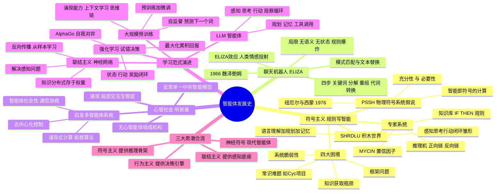
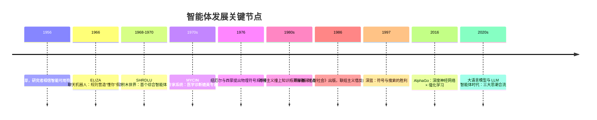
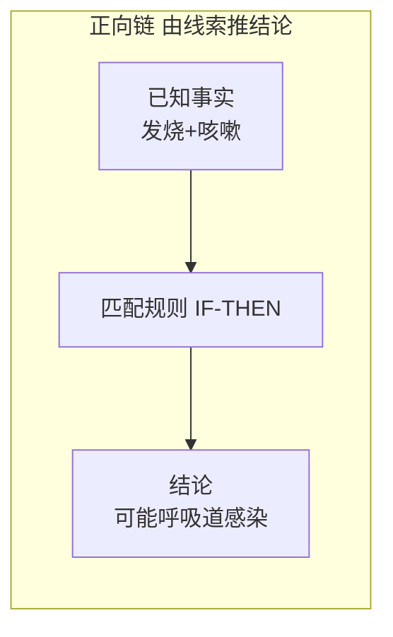
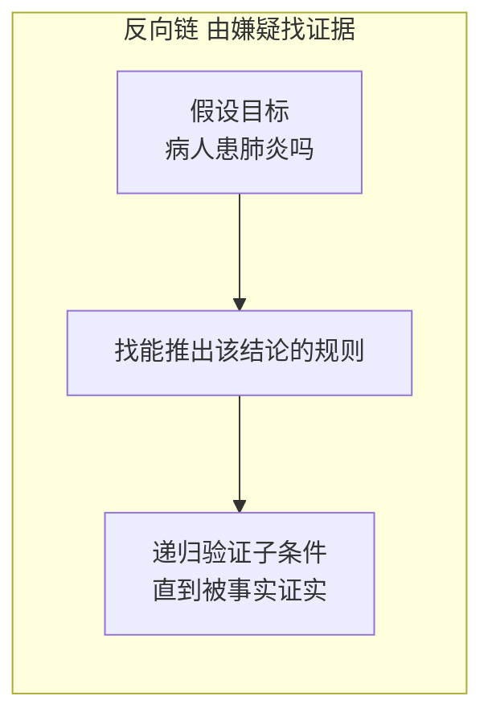
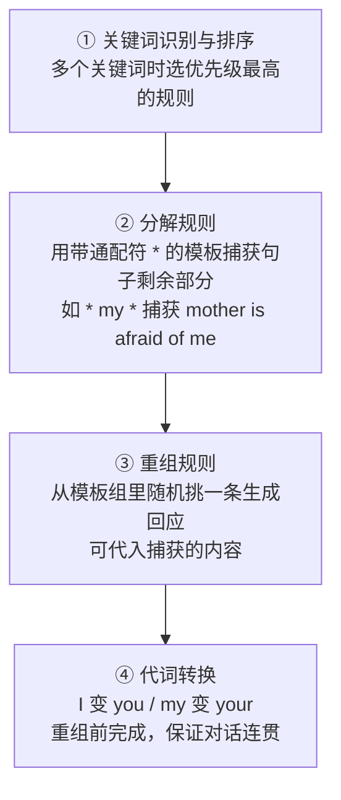
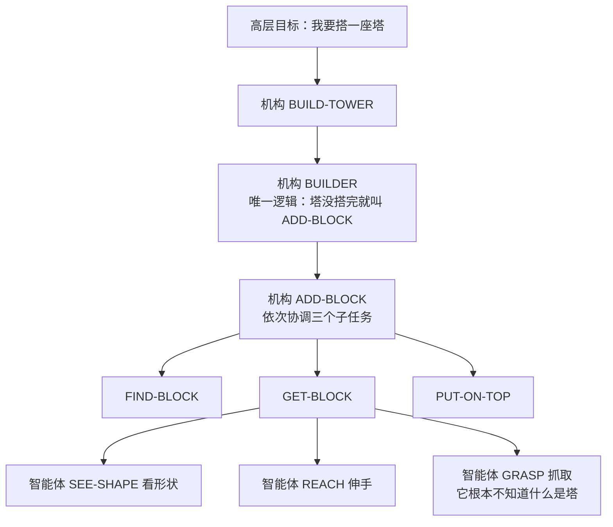
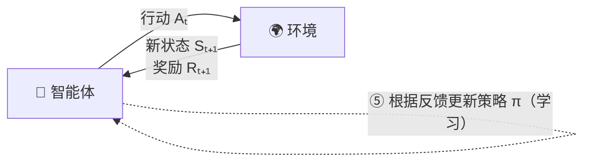
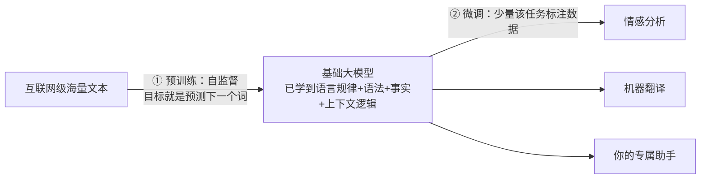
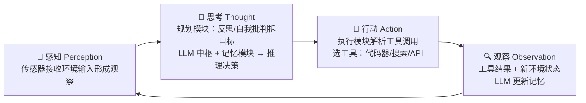
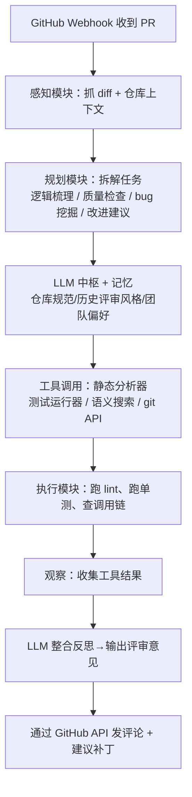

# CHAPTER 2 Notes 智能体发展史


智能体的历史像接力赛


---

## 🧠 全章思维导图



---

## ⏳ 关键时间线



---

## 2.1 符号主义 把世界写成一本"死板的菜谱"
Symbolicism，也叫"逻辑 AI / 传统 AI"。核心信念：**智能体的"智慧"全部来自**设计者预先写好的知识库和推理规则**，不会自学。


### 🏥 专家系统 像一位"背了一千页秘籍的老医师"

| 部件 | 比喻 | 职责 |
| --- | --- | --- |
| **知识库** | 老医师的《诊疗秘籍》 | 存放"IF-THEN"产生式规则，如 `IF 发烧 AND 咳嗽 THEN 可能呼吸道感染`，复杂系统有成百上千条 |
| **推理机** | 查秘籍的"辨证过程" | 拿用户提供的事实去匹配规则，推导新结论 |

推理机两种工作方式





- **正向链**：数据驱动。从线索出发一路推到结论（福尔摩斯观察脚印）。
- **反向链**：目标驱动。先立假设再倒查证据（预审法官先定嫌疑人再核证据链）。

**明星案例：MYCIN**（斯坦福，1970s，诊断细菌性血液感染 + 开抗生素）


### 🧱 SHRDLU —— 玩具房里无所不能的完美管家
。

历史地位三点：

- ✅ **综合性智能典范**："感知—思考—行动"闭环设计，**奠定了现代智能体研究的基础**；
- ✅ **微观世界方法普及**：证明"先在规则完备的简化沙盒里验证智能原理"这条路可行，影响后世机器人学与 AI 规划；
- ⚠️ **乐观与反思并存**：激发第一轮 AGI 乐观潮，但它一出积木世界就傻眼——引发"符号处理 vs 真正理解"的长期争论。

### 🧱 符号主义撞上的四面高墙（1980s 起）

| 困境 | 一句话人话 | 生动画面 |
| --- | --- | --- |
| **知识获取瓶颈** | 专家知识要人肉访谈→提炼→编码成规则，贵、慢、无法规模化；而且人的很多知识是**说不清的直觉** | 请全人类专家坐下来，把一辈子经验默写成 IF-THEN——写不完 |
| **常识问题** | "水是湿的""绳子能拉不能推"这类背景知识，没编码系统就一概不知 | Cyc 项目花几十年录常识，至今成果有限——想手动抄下整座图书馆 |
| **框架问题** | 动作执行后，如何高效知道**哪些东西没变**？逐一声明"不变"算力上不可行 | 你挪走一个杯子，系统要宣告 80 亿条"××没变化"；人类只瞄一眼就行 |
| **系统脆弱性** | 规则外有任何微小变化就彻底失灵，不会变通 | 超市自助结账机遇到压碎的薯片袋直接死机 |

> 💡 ：**"背不完的知识、说不清的常识、列不尽的变化、容不下的意外"**。

---

## 2.2 ELIZA —— 一只听不懂人话、却装得很懂的"鹦鹉"

> **一句话记忆**：ELIZA 证明了——**不懂内容也能营造"智能"的假象**，而这假象的观众其实是人类自己。

1966 年，MIT 的 **魏泽鲍姆（Weizenbaum）** 发布。它不是单一程序，而是一个**跑脚本的框架**，最著名的脚本"DOCTOR"模仿罗杰斯学派心理治疗师。

🎭 **设计者的真实意图特别反转**：魏泽鲍姆**故意**做了一个完全不理解内容的系统，想证明"简单句式转换就能骗到人"。结果——连他**自己的秘书**都对 ELIZA 产生了情感依赖。作者本意是泼冷水，观众却入了戏。

### ⚙️ 核心机制：模式匹配 + 文本替换，四步走完



示例：用户输入 `My mother is afraid of me` → 命中关键词和分解规则捕获 `mother is afraid of me` → 代词转换 → 套模板输出 `Tell me more about your family.`

迷你实现的核心逻辑（Python，对应书中代码）：

```python
def respond(user_input):
    for pattern, responses in rules.items():      # 按规则库逐条匹配
        match = re.search(pattern, user_input, re.IGNORECASE)
        if match:
            captured = match.group(1) if match.groups() else ''   # ① 捕获 * 部分
            swapped  = swap_pronouns(captured)                    # ② 代词转换
            return random.choice(responses).format(swapped)       # ③ 随机套模板
    return random.choice(rules[r'.*'])                            # ④ 兜底通配规则
```

跑起来的对话效果：

```text
You: I am feeling sad today.
Therapist: How long have you been feeling sad today?
You: My mother is not happy with my work.
Therapist: Tell me more about your mother.
```

### 🚨 亲手写一遍后你会立刻看懂的三大局限（正是 2.1.4 理论困境的实机演示）

1. **缺乏语义理解** —— `I am **not** happy` 照样匹配 `I am (.*)`，机械反问"How long have you been not happy?"：它**不认识"not"**；
2. **无上下文记忆（Stateless）** —— 只盯当前这一句，聊不了多轮连贯对话；
3. **规则扩展性灾难** —— 规则越多，冲突和优先级管理越爆炸，最终没法维护。

### 👻 ELIZA 效应

尽管缺陷明显，大量用户**深信**它理解自己。因为：① 它扮演被动的提问者、狂用开放式模板，把说话压力全甩给用户；② **人类天生爱把情感投射到会应答的东西上**。

> ⚡ 本章金句：系统看似智能的表现完全依赖预设规则；面对真实语言的**无限可能性**，穷举式方法**注定不可扩展**。没有真正的理解，只有符号操作——这就是脆弱性的根源。

---

## 2.3 心智社会 —— 蚂蚁军团建起的智能帝国

> **一句话记忆**：明斯基掀桌子：别再造一个"全能大脑"了！智能 = 一群什么都不懂的家伙**互相激活、互相拆台**之后**涌现**出来的现象。

明斯基（Marvin Minsky）的灵魂拷问（书中原话翻成大白话）：

> "让机灵的妙招是什么？妙招就是**没有妙招**。智能的力量来自我们内部巨大的多样性，而不是某条单一的完美原理。"

### 🏛️ 反思：自上而下的"中央计划经济"走不通

专家系统没有儿童般的常识；SHRDLU 出不了积木世界；ELIZA 不懂自己在说啥。它们的通病：一个全知全能的**中央处理器 + 一套统一逻辑**处理一切——而自然智能根本不是这么运行的。

明斯基提出三个根本问题：

- **理解是什么？** 单一能力？还是视觉化 + 逻辑 + 共情 + 社会常识……几十种过程协作的结果？
- **常识是什么？** 数百万条规则的巨型知识库（Cyc 的路线）？还是无数经验片段织成的分布式网络？
- **智能体该怎么造？** 追求完美统一逻辑系统，还是承认智能本来就是"一堆会互相打架的简单部分"组成的**大杂烩**？

### 🐜 正解：扁平的"社会"，不是金字塔的"层级"

| 概念 | 含义 | 比喻 |
| --- | --- | --- |
| **智能体（agent）** | 极简、专门化、**自身无心**的心智过程，如 `LINE-FINDER`（认线的）、`GRASP`（抓握的） | 流水线工人：只会拧一颗螺丝 |
| **机构（Agency）** | 一组智能体协同完成更复杂任务，如 `BUILD` 由 `SEE/FIND/GET/PUT` 组成 | 班组 / 部门 |
| **涌现（Emergence）** ⭐ | 复杂智能行为**不由任何高层预先规划**，而是海量底层个体局部交互**自发产生** | 没有总指挥，蚁群却搭起了桥 |

经典例子"搭积木塔"，一层层往下激活，**没有谁见过全局蓝图**：



### 🎁 最深远的影响：给多智能体系统（MAS）开了个头

明斯基的追问：**如果一个心智内部的智能能靠一群简单智能体涌现，那多个物理上独立的计算机/机器人之间，能不能也涌现出"群体智能"？**

研究焦点从此从"造一个全能个体"转向"**设计一批高效协作的群体**"。三大直接启发：

1. **去中心化控制** → 没有中央节点怎么协调、怎么分任务，成了 MAS 核心课题；
2. **涌现式计算** → 蚁群算法、粒子群优化：简单局部规则解决复杂优化；
3. **智能体的社会性** → 通信语言（ACL）、交互协议（契约网）、协商策略、信任模型——真正"计算社会" toolkit。

> 💡 对照图 2.1 时间轴：心智社会是从"集中→分布"的转折点，2020s 的 Multi-Agent 协作框架（AutoGen、CrewAI、MetaGPT…）都是它的隔世徒孙。

---

## 2.4 学习范式 —— 别抄课本了，让机器自己“学会做题”

> **一句话记忆**：符号主义的病根是"人类手喂知识"；既然智能没法完全**设计**出来，那能不能**学**出来？——学习时代开幕。

### 🕸️ 联结主义：给机器装一张"会自己长肉的神经网"

1980s 兴起，模仿生物大脑。与符号主义**自上而下写规则**针锋相对，它是**自下而上**的：

| 核心思想 | 对照符号主义 |
| --- | --- |
| 知识**分布式编码在连接权重里**，不在任何一条规则里 | 知识集中存放在显式符号 / 知识库 |
| 每个神经元只做加权求和 + 激活函数，傻得可爱 | 推理机跑完整逻辑链 |
| 靠**反向传播**大量迭代调权自动学习 | 人类手写规则 |
| **肌肉记忆**比喻：球感长在每一块肌肉的连接里，说不清规则但打得出手 | **背谱下棋**：背千谱仍遇新手 |

🖼️ 范式对比图：


> ✅ 联结主义 + 深度学习解决了**感知**（"图里是什么？"）。但智能体的命根子是**决策**（"我该干什么？"）——得请下一位：强化学习。

### 🐶 强化学习：不用标准答案，靠"糖果和挨饿"训出策略

AlphaGo 自我对弈就是经典案例。五要素用"训小狗接飞盘"对照记：

| RL 要素 | AlphaGo 里是 | 训狗对应 |
| --- | --- | --- |
| 智能体 Agent | 决策程序 | 狗 |
| 环境 Environment | 围棋规则 + 对手 | 院子 + 飞盘 |
| 状态 State S | 棋盘局面 | 飞盘正在哪、风多大 |
| 行动 Action A | 在合法点落一子 | 跳 / 跑 / 张嘴 |
| 奖励 Reward R | 赢 +1 / 输 -1 | 肉干 🦴 / 无奖励 |



🖼️ 原书交互循环图：


三个必背要点：

- **策略 Policy π**：状态 → 行动的映射，智能体的"行为方式"；
- **目标不是即时奖励，而是累积奖励 / 回报（Return）**：得有"远见"，必要时弃子取势；
- 试错学习、自主生成——AlphaGo 的棋艺**不依赖人类棋谱指导**。

> ⚠️ 新痛点：RL 需要**海量任务专属交互数据**，启动时像个没有先验知识的婴儿，什么都要从零撞。符号主义想手写的常识，RL 智能体同样没有。怎么办？——下一位选手直接"读完了互联网"。

### 📚 大规模预训练：先读万卷书，再入职实习

旧时代：每个任务（情感分析、翻译）都标一批数据、从零训一个窄模型——费钱、不会举一反三。

**预训练-微调范式**横空出世：



🖼️ 原书示意图：


LLM 的两个关键意义：

1. **用全新方式干掉了"知识获取瓶颈"**：数万亿 token 预训练后，模型权重就是"一张**高度压缩的世界知识隐式模型**"，根本没人手写规则；
2. **规模跨过阈值后出现【涌现能力】**（没专门训练、计划外的本事）：
   - **上下文学习 In-context Learning**：prompt 里塞几个示例（few-shot）甚至零示例就能干新任务，**权重都不用改**；
   - **思维链 Chain-of-Thought**：让它"先写推理过程再答"，逻辑/算术/常识题正确率飙升。

至此，LLM 已经是兼具**"海量知识库 + 通用推理引擎"**双重身份的组件——符号时代"知识库 + 推理机"的架构，以一种全新方式回来了。

### 🤖 基于 LLM 的智能体：给读万卷书的"大脑"配上眼手脚

LLM 智能体 = 能自主**感知、规划、决策、执行**的系统。核心循环四步（对应图 2.10）：



🖼️ 原书架构图：


> 🔁 每一轮的"工具结果 + 新环境状态"会被感知模块再次捕获，触发新一轮"感知—思考—行动"。**模块化协同 + 持续迭代闭环 = 解决复杂问题的核心工作流**。
> 🕰️ 历史闭环彩蛋：专家系统 = 知识库+推理机；今天 = LLM（知识库+推理机二合一）+ 记忆 + 规划 + 工具。架构神似，血肉全换。

### 🌊 三大思潮合流（图 2.11 时间线的精神提炼）

| 流派 | 代表人物 | 主张 | 代表成果 | 留给今天的遗产 |
| --- | --- | --- | --- | --- |
| **符号主义** | 西蒙、明斯基等 | 智能 = 操作符号 + 逻辑推理 | SHRDLU、专家系统、深蓝 | 推理、规划、可解释的结构化控制 |
| **联结主义** | 辛顿等 | 模仿大脑神经网络，学权重 | 反向传播、CNN、Transformer | 感知、模式识别、今天 LLM 的底座 |
| **行为主义** | （强化学习一脉） | 在与环境互动试错中学策略 | TD-Gammon、AlphaGo | 决策、长期回报优化 |

> 💡 神经-符号的现代智能体：LLM 是**联结主义的产物**，却充当**执行符号推理、工具调用、规划决策的核心大脑**——半世纪三大流派在同一个架构里会师。


---

## 🗂️ 一页速记卡| 人 | 干了什么 | 一句点评 |
| --- | --- | --- |
| 纽厄尔 & 西蒙 | PSSH：智能 = 符号处理 | 给符号主义发了结婚证 |
| MYCIN 团队 | 600 条规则 + 反向链 + 置信因子 | 专家系统之王，诊断平人类专家 |
| 威诺格拉德 | SHRDLU 积木世界 | 第一个"感知—思考—行动"闭环全能选手 |
| 魏泽鲍姆 | ELIZA | 想证明机器只会唬人，结果人类自愿入戏 |
| 明斯基 | 心智社会 | 智能不在一个脑袋里，而在一群"无心鬼"的协作里 |
| 辛顿等 | 反向传播带火神经网络 | 知识从规则文本改为权重 |
| DeepMind | AlphaGo：深度网络 × RL | 试错学决策的天花板 |
| OpenAI 等 | GPT-3 → ChatGPT → Agent | 预训练解决知识瓶颈；上下文学习、思维链两记涌现重锤 |

---

## 📝 习题详解


### 习题 1 · 物理符号系统假说三连问

🔑 **拆关键词**：充分性 vs 必要性（概念题）｜"哪些实践问题挑战了充分性"（举证题）｜"LLM 符合 PSSH 吗"（开放思辨题）。

🧭 **思路**：先准确复述两个论断 → 把 2.1.4 的四大困境逐一映射到"符号系统 ≠ 足够聪明的充分条件"→ 最后一问问的是"经验证据是否还撑得住 PSSH 的论断"，需拆成两层：形式定义（LLM 在物理上是否操作符号）+ 哲学含义（它是否反驳"必要性"）。

1. **含义**：充分性 = "物理符号系统具备产生通用智能的足够 Means"，即符号操作这一种手段**就够用**；必要性 = "凡是通用智能系统**必然**是物理符号系统"，即符号操作是**必由之路**。
2. **挑战"充分性"的实践问题**：① 知识获取瓶颈——符号系统的前提是拥有完备知识库，而人类内隐知识无法穷举编码，手段"充分"但**原料凑不齐**；② 常识问题（Cyc 收效有限）；③ 框架问题——动态世界中"不变"的声明在计算上不可行；④ 脆弱性——规则外情形立即失灵，SHRDLU 离了积木世界就不行。这些说明：即便承认符号手段充分，**工程/计算约束下它走不到通用智能**。
3. **LLM 是否符合 PSSH（开放题，建议两边都说）**：
   - **表面支持侧**：LLM 处理 token（可区分的符号单元），可视为一种物理符号系统，呼应"充分性"。
   - **实质冲击侧**：其智能**不来自显式符号规则与逻辑推理**，而来自**亚符号的数值分布式表征与统计模式**——既绕开了手工知识工程（挑战必要性——"不靠符号规则也能通用"），也复活了涌现（与心智社会遥相呼应，但不是"一群无心 agent"，而是"一窝无心智神经元"）。
   - **高分结论**：LLM 的崛起说明 PSSH 更像**特定历史阶段的有效理论**而非宇宙真理：充分性存疑，**必要性已被证伪**——通用智能还有另一条路。

### 习题 2 · MYCIN 为什么没能真正开进医院（+ 设计新一代医疗智能体）

🔑 ："显著成功但未大规模应用"= 成功 ≠ 落地。题目自带**多维提示**（技术 / 伦理 / 法律 / 用户接受度）。第②问=现代方案设计题；第③问=选型判断题。

🧭 题目**明确说除此以外的因素**。逐维开脑洞：责任归谁？谁签字担责？规则可审查吗？医生买账吗？成本划算吗？


1. **技术之外的阻碍因素**：
   - **法律**：诊断出错**谁担责**——医生、开发者还是医院？当年没有先例。
   - **伦理**：让机器给活人开抗生素，决策权归属和知情同意存争议。
   - **监管**：药品审批路径清晰，"软件当医生"当年无注册审评通道。
   - **用户接受度**：医生反感被系统"考核"；交互必须问答式、耗时；病历信息结构化程度低。
   - **运维**：医学知识更新快 → 600 条规则要持续人肉维护维护。医院养不起。
   - **缺乏概率严谨性**：CF 不是贝叶斯，多证据合并时曾被质疑数学不自洽。
2. **如果今天我来设计医疗诊断智能体**：
   1. LLM 做理解 + 生成解释；**结构化知识图谱 + 临床指南**做硬约束（用神经 + 符号双保险）；
   2. RAG 挂接最新指南与文献，解决知识更新；
   3. 不确定性用**校准后的贝叶斯方法**替代 CF，报告置信区间；
   4. **人在环中**：永远只做"第二意见"，处方由医师最终签字；
   5. 全链路审计日志 + 本地部署脱敏 + 药品交互禁忌等规则硬编码兜底；
   6. 小范围多中心临床试验后再合规申报。
3. **规则系统至今更好的领域**：共同特征——**规则封闭完备 + 必须可解释 + 零容错或法规强制审计**：① 税务计算 / 报税系统；② 薪酬与社保公积金核算；③ 航空订票改签订退票政策；④ 医保目录审核与理赔规则；⑤ 工业安全联锁 / 电梯控制；⑥ 合规与反洗钱规则引擎。原因：领域可穷举、错误可追责、审计要求给出明确 IF-THEN，而深度模型的统计性输出反而不合格。

### 习题 3 · 扩展 ELIZA 动手实践

🔑 动手题——加规则、加"记忆"；问的是**差异与数学**：ELIZA vs GPT（至少 3 维度）；"组合爆炸"要给出定量论证。

🧭 代码用最小修改演示 stateful 设计；对话维度按**表征→学习→泛化→状态→知识边界**逐层拉开差异；组合爆炸用指数/幂级数语言论证。

1. **新增 3-5 条规则**：

```python
rules.update({
    r'I work (as|at|in) (.*)': [
        "Why did you choose to work {0} {1}?",
        "What do you enjoy most about being {1}?",
    ],
    r'I (study|major) in (.*)': [
        "What drew you to {1}?",
        "How do you feel about studying {1}?",
    ],
    r'My (hobby|favorite) .* is (.*)': [
        "How long have you enjoyed {1}?",
        "What does {1} give you that other things don't?",
    ],
})
```

2. **上下文记忆实现（演示"从无状态到有状态"）**：

```python
memory = {"name": None, "job": None}   # 跨轮保存关键信息

def respond(user_input):
    # 抽取并记账
    m = re.search(r'my name is (\w+)', user_input, re.I)
    if m: memory["name"] = m.group(1).capitalize()
    m = re.search(r'I work (?:as|at|in) (.*)', user_input, re.I)
    if m: memory["job"] = m.group(1)

    for pattern, responses in rules.items():
        if m := re.search(pattern, user_input, re.I):
            resp = random.choice(responses).format(
                *[swap_pronouns(g or '') for g in (m.groups() or ('',))])
            if m := re.search(r'How are you|feel', resp, re.I):
                if memory["name"]: resp += f", {memory['name']}"
            return resp
    return random.choice(rules[r'.*'])
```

3. **扩展后 ELIZA 与 ChatGPT 的本质差异（≥3 维）**：

| 维度 | ELIZA | ChatGPT |
| --- | --- | --- |
| 知识来源 | 人肉编写规则 | 互联网规模语料**自动学习** |
| 处理单位 | 词形（表层字符串） | 高维向量（接近词义的分布式表征） |
| 泛化 | 对未见句式只会兜底 | 可 zero-shot 完成未见过的任务 |
| 对话状态 | 单句无状态（除非自行补丁） | 有上下文窗口，跨轮连贯 |
| 生成方式 | 从固定模板里挑 | 逐 token 开放式生成 |
| 可扩展性 | 改规则 → 冲突爆炸 | 扩数据/参数 → 能力增强 |

4. **"组合爆炸"与数学说明**：设词表 V≈10⁴，平均句长 n≈10，可能合法句数 ~10⁴⁰ 量级。规则要可靠覆盖需应对长度递增，规则需求 ∝ |V|ⁿ，是**指数爆炸**。ELIZA 用"关键词 + 通配符"把每条规则从匹配具体句子降级为匹配模板，才把规则压到 O(k)，但代价是**覆盖率永远追不上合法输入集**，未命中只能输出泛化回答。对比之下，LLM 用参数 θ 拟合分布 P(下一个词|前文) 来**泛化**而非**枚举**，把知识存进连续权重矩阵，天然处理未登录模式。这正是"写不完规则 / 学不尽模式"的根。

### 习题 4 · 心智社会三连问

🔑 "GRASP 失效会怎样"（架构故障推理）；"vs MetaGPT/CAMEL/CrewAI"（对比题）；"LLM 还有推理能力，明斯基过时没？"（观念题）。

1. **GRASP 失效的后果**：`GET-BLOCK` 会一直派发，手停在积木前抓不住 → 塔永远多不了一块 → 系统级表现为**任务停滞但不会整体崩溃**（其余功能正常继续）。没有中央控制器，所以不会有全局报错，只能依赖同级监督机制（比如 CHECK-GRIP 机构反馈"没抓住"）触发重试或启用备用抓取机构。
   **优点**：优雅降级（局部失效不拖死全局）、易扩展（新智能体直接插进来）、鲁棒容错（可互相备份）。**缺点**：① 无全局状态 → 故障定位极难（涌现行为没人写进过 bug 清单）；② 激活/抑制环路可能死锁或振荡，两机构互 inhibiting 谁也不让谁干；③ 无监督 → 结果不可预测性。
2. **与 CAMEL Workforce / MetaGPT / CrewAI 的对比**：
   - **联系**：都主张"任务靠分工协作，不靠单体全能"：智能体专门化、层级化（CEO/CTO/工程师）；复杂行为由交互涌现；去中心化消息传递与反馈驱动。
   - **不同**：① 明斯基的子模块**极简单且无心**（`GRASP` 只会抓），而现代 MAS 的每个成员都是**全功能 LLM**——单个就极"有心"；② 明斯基的协作靠**隐式激活/抑制**，现代框架靠**显式通信协议和编排/工作流引擎**，通常存在一个"调度员"（如 ProcessEngine 或 manager agent）；③ 心智社会是**解释心智的认知理论**，CrewAI 们是解决工程问题的**工具箱**。
3. **LLM 时代明斯基过时了吗？——没有，只是换壳复活**：
   - 在**系统层**：MetaGPT 的多角色协作正是"机构分工"的工程翻版；
   - 在**模型层**：LLM 本身就是"心智社会"！MoE 架构 = 各专家子网络 + 门控路由（激活/抑制机制），神经网络的海量神经元单元都"无心"，智能只涌现于集体。
   - **差异**：明斯基预设的 agent 是手工构造的逻辑小模块；LLM 时代，单个"agent"已具备通用推理。所以理论从"**如何涌现**"的指导意义变成了"如何组织**有心个体**协作"的新 MAS 问题。

### 习题 5 · 强化学习 vs 监督学习

🔑 用**机制**说 AlphaGo 试错｜"为什么适合序贯决策"｜"马里奥该用监督还是强化"（选型 + 数据需求）｜"RL 在 LLM 训练中的角色"。


1. **AlphaGo 的试错机制**：自我对弈数百万局 → 每局结束只拿到一个**稀疏的最终信号**（胜 +1 / 败 -1）→ 把这个延迟信号**分摊归因**到整盘每一步棋的价值估计（价值网络 + 蒙特卡洛树搜索）→ 据此调整策略网络 → 下一轮更优。无标准答案，只靠**后果打分**。
2. **为什么 RL 适合序贯决策**：① 当前行动的"好坏"取决于**后续一串行动共同造成的终局**（一步棋无法脱离棋局判对错）；② RL 优化目标就是**累积回报**（含时序信用分配），监督学习只能拟合"独立同分布的瞬时标签"；③ RL 能利用**探索**发现监督数据里根本不存在的策略（AlphaGo 第 37 手）。
   **数据需求差异**：监督要大量 (输入, **教师标注的正确输出**) 对；RL 只要一个**能交互的环境 + 奖励函数**，数据是自己在探索中生成的。有教师→监督；无教师但有目标函数→强化。
3. **马里奥智能体**：
   - **监督学习**：需要海量人工游戏录像（屏幕画面 → 手柄操作）逐帧对齐——即**"最优玩家示范"**，问题：谁给"最优"？且分布被人类操作束缚，上限 = 人类。
   - **强化学习**：只需游戏模拟器（环境）+ 奖励函数（过关 +1 / 掉命 -1 / 金币 +small reward），智能体自己刷几百万关。
   - **更合适**：**强化学习**——有可交互环境、有明确的目标量，且**没有现成的标准操作序列**（最优策略未知）。
4. **RL 在 LLM 训练里的关键作用**：预训练 + SFT 后的**RLHF/DPO 对齐阶段**：人类对多个候选回答排序 → 训练奖励模型 → PPO 优化生成策略，让模型"有用、诚实、无害"；还有**推理模型（o1 式）**用 RL + 过程奖励训练长思维链，显著提升数学/逻辑能力。一句话：SFT 教会说"人话"，RL 教会说"**人类喜欢且对的话**"。

### 习题 6 · 预训练-微调范式三连问

🔑 "为什么解决了知识获取瓶颈 + 表示方式上本质区别"（对比概念题）｜"互联网数据来源的问题与缓解"（工程伦理题）｜"这范式会被替代吗"（开放预测题）。


1. **解决方式 + 本质差异**：符号时代需要专家**显式枚举**知识，人肉搬运、穷举不完。预训练用**自监督**（"预测下一个词"）把海量无标注文本变成取之不尽"免费题"，把语言规律甚至世界常识**自动内化成连接权重**。对比：符号知识"写在纸上"，可逐条审查、但死板有限；预训练知识"熔在钢筋里"，无边界、可泛化，但**难精确定位**、**不总是可取**（引出幻觉）。
2. **互联网数据带来的问题 + 缓解**：
   - **偏见固化放大**（性别/种族/文化）→ 数据配比与去偏、RLHF；
   - **错误与谣言入脑（幻觉来源）**→ 检索增强生成 RAG 外挂权威资料、事实核查、训练期低质量数据过滤；
   - **有害内容** → 安全过滤数据集 + 对齐；
   - **版权/隐私** → 授权语料、数据溯源、去重（P-II 清洗）；
   - **知识截止** → RAG + 联网工具。
3. **会被取代吗？（开放题，立场明确即可）**：
   - "先通用奠基、再轻量适应"的**预训练范式本身已成基石**，大概率**长期存在**，但形态在演化：
   - 可能方向：**续预训练 / 在线学习**代替冻结后微调；**上下文即参数**（长上下文、in-context 学习把"微调"搬到一个 window 里）；**测试时训练**（对每题现场学习）；智能体式持续学习，交互即训练。
   - 高分回答建议表态：范式会"变形"而非"被颠覆"——就像"知识 + 推理"这面专家系统旗帜从未消失，只是把"知识库"换成了 1.3 万亿参数。

### 习题 7 · 跨时代设计"智能代码审查助手"

🔑 **同一任务三时代三种做法，再收拢成演进洞察**——"几乎不可能 → 可行"。本题就是全章知识点的**应用大合集**。


**① 符号主义时代（1980s）**：手写代码规范规则库（几千条 IF-THEN）+ 正则 / AST 模式匹配 + 数据流静态分析（判空指针、未初始化）。
**困难**：无法理解代码"意图"；"重构建议"“逻辑漏洞"这种需要常识与语义的任务规则写不出来；语言一升级、框架一更新 → 规则全重写（脆弱性 + 知识获取瓶颈 + 规则爆炸三大痛击再现）。→ 只能自动 lint 风格，离"审查"很远。

**② 深度学习时代（2015，无 LLM）**：图神经网络 / CNN/RNN 编码（或从漏洞库学模式），如 bug 分类、代码克隆检测；数据源：带标注的 commit 历史。
**能做的**：训练"发现空指针错误、内存泄漏"分类器。
**仍不能**：不能生成自然语言评语，不能理解业务背景，不能"提出修改建议"——**只有判别，没有生成和推理**。

**③ 大模型 + 智能体时代（图 2.10 架构）**：



具体模块：**感知**：GitHub API 取 PR diff；**规划**：把审查拆为四个子任务，用"反思/自我批判"迭代复查；**记忆**：团队编码规范 + 历史误判案例；**工具**：AST 检查、安全扫描、测试沙箱、代码检索向量库；**行动**：LLM→结构化意见→GitHub API 评论。

**④ 三时代对比 = 智能体演进的缩影**：

| 能力 | 1980s | 2015 | 今天 | 技术来源 |
| --- | --- | --- | --- | --- |
| 读规则 | ✅ 手写规则 | 🔶 弱泛化 | ✅ 零样本 | 符号 → 统计学习 → 预训练知识 |
| 理解语义 | ❌ | ❌ | ✅ | 上下文向量 + 世界知识 |
| 生成人话评论 | ❌ | ❌ | ✅ | seq2seq → Chat 模型 |
| 执行工具 / 闭环 | ❌（人工触发） | ❌（流水线） | ✅ 自主循环 | RL "感知-行动"闭环 + SHRDLU 式综合智能体 |
| 维护成本 | 规则爆炸 | 标注爆炸 | 改 prompt / 换工具即可 | 预训练免手工编码 |

**结论**：任务没变，变的是知识从"人肉编码"到"机器自学"、能力从"判别"到"生成 + 推理 + 行动"、架构从"单一引擎"到"心智社会式模块闭环"。三个世纪的思想遗产（符号的规划与工具结构、联结的知识与感知、行为的试错与反馈）合在一起，才把"代码审查助手"从科幻变成今天的 Copilot / CodeRabbit。

---

## 🌟 本章终极复盘（把 7 道题串成一句话）

> **当符号规则穷举不了真实世界的知识，机器就开始从数据里"涌现"自己；于是智能体的能力边界不再由工程师手写的规则决定，而由它的训练数据、模型规模、协作架构与工具链决定——这正是现代 LLM 智能体的由来。**